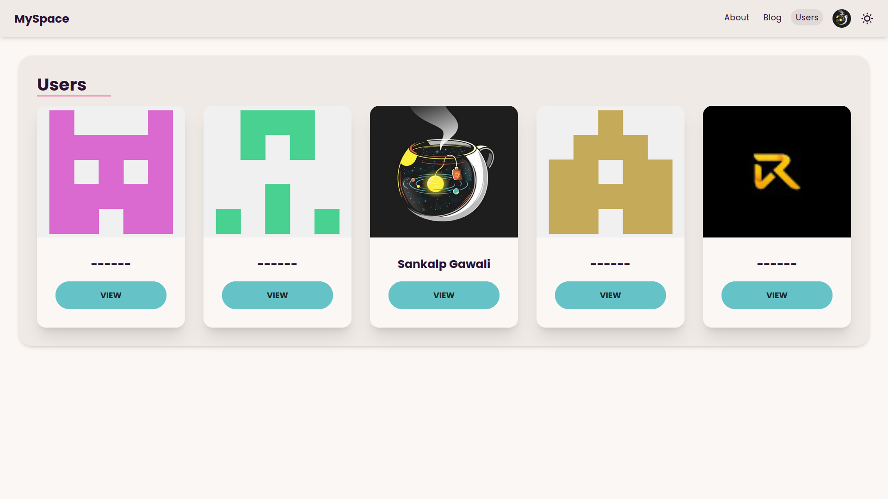

# My Space
A simple My Space app made with the Next.js ecosystem,
focusing on learning Next.js structure and authentication.

This was based on the fireship nodejs tutorial.

## Preview


## Try it yourself
You can find the live version [here](nextjs-my-space.vercel.app/)

## Features
- Next.js app routing
- Authentication using Nextauth.js/Auth.js
- Prism ORM with postgresql database
- Personizable user profile page

## Running it locally

### Prerequisites
Before running the application, you'll need the following:

- Node.js and bun or npm installed on your system.
- Postgresql installed locally or a connection to a Postgresql instance.

### Installation

1. Clone the repository:

```bash
git clone https://github.com/Sankalp-G/nextjs-my-space
```

2. Install dependencies:

```bash
cd nextjs-my-space
bun install
```

3. Set up environment variables:
   - Create a `.env` file in the root directory.
   - Add the necessary environment variables based on `.env.example`

4. Start the application:

```bash
bun dev
```

5. Visit `http://localhost:3000` in your web browser.